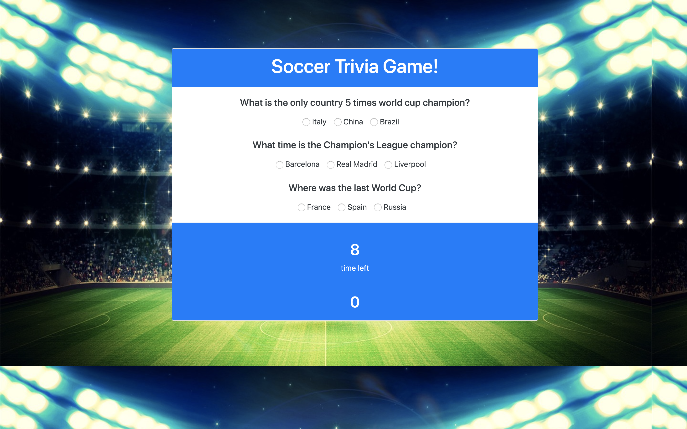

# Soccer Trivia Game

# Test your soccer game skills with this fun trivia game. Your have 15 seconds to answer the questions. Have fun!
----
### Technologies used on this project:
* HTML 5
* CSS 3
* Javascript
* Jquery
* Live code Studio
---
* Game screen shot

---
## The following piece of code uses on.click method to identify the the answer given by the user.
```javascript
 //onclick function  question 1
         $(".question1").on("click", function() {
        // alert("I've been clicked!");
        var questionValue = $(this).val();
        console.log(questionValue);
        if ($(this).attr("data-answer") === "correct1") {
            right++;
            $(".incorrect1").empty();
            $(this).attr("data-answer","counted");
            $('.question1').prop("disabled", true); 
            $("#correct-answer1").text("This is the right answer! 1 point for you!");

            console.log(right)
        } else {
            $(".incorrect1").empty();
            $("#brazil").remove();
            $(this).attr("data-answer","counted");
            $("#correct-answer1").text("Wrong! no points for you! the right answer is:");

        }
    });
```
---
> Author
 Alexei Dias
 Linkedin 
 https://www.linkedin.com/in/alexei-dias-b4054a164/


